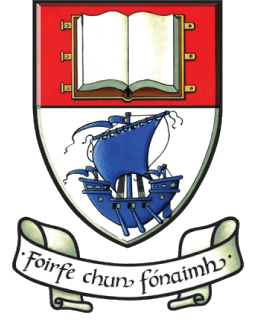

## Uathcruthú Landing Page

[Uathcruthú](https://uathcruthu.herokuapp.com/) is a web application that was written up as a final year project submission for the WIT Higher Diploma in Science in Computer Science. It is used to automate the processing of project submission data into a project showcase.
As part of the submission process for Final Year Project for the Higher Diploma in Science in Computer Science at WIT, each student must submit some data about the project that can be used to summarise their work on a one page entry in a 'showcase handbook'. This application serves as a means to submit that data.
This application can be used by both students and administrators. The student submits their data using the webform contained therein, and the administrator can then create the handbook based on this input and their own additional input.
This application is written in node.js on the hapi framework.

### Implementation
* The application can be deployed from the [repository](https://github.com/cathalohinse/Uathcruthu), by following the instructions on the README.md file contained therein.
* The application has also already been deployed using heroku, and can therefore be accessed on the [browser](https://uathcruthu.herokuapp.com/).

### Links
* [Uathcruthú](https://uathcruthu.herokuapp.com/)
* [Demonstration Video](https://www.youtube.com/watch?v=Uh36o_e1Kw4)
* [GitHub Repository](https://github.com/cathalohinse/Uathcruthu)
* [Trello Board](https://trello.com/b/3GvQzJVK/uathcruth%C3%BA)

  

